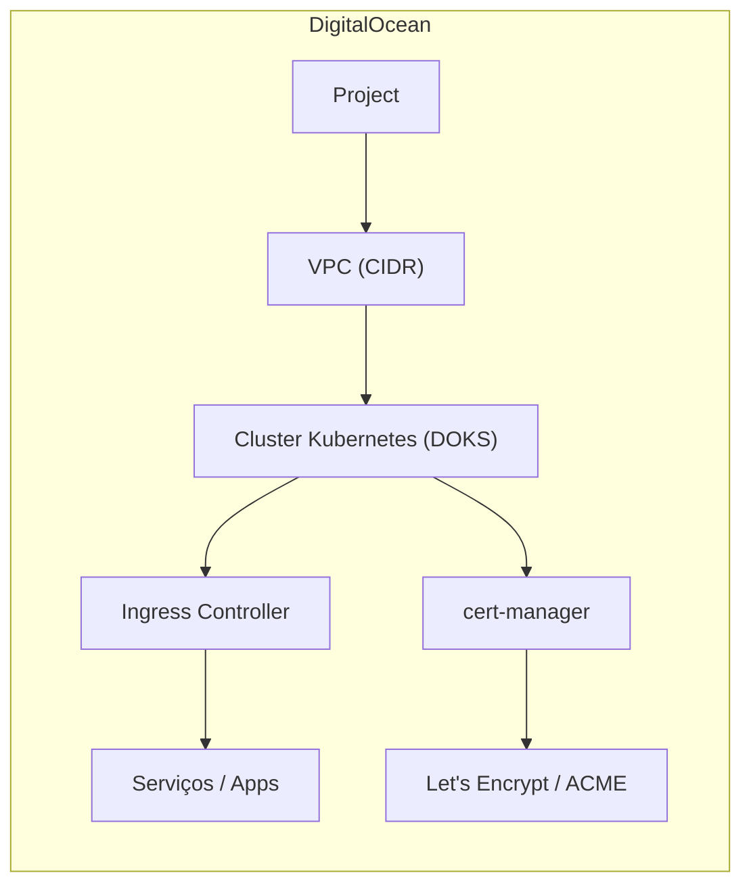

# Provisionamento de um cluster Kubernetes na DigitalOcean usando Terraform

Estrutura modular (projeto, VPC, cluster, ingress e emissão de certificados TLS).

> ⚠️ **Custos**: este repositório cria recursos pagos na DigitalOcean. Use em ambiente de testes com parcimónia e elimine os recursos ao terminar (ver **Limpeza**).

---

## 🚀 Objetivo

Automatizar a criação de um ambiente Kubernetes completo e seguro na DigitalOcean:

- Criação/associação de **Projeto** no DigitalOcean
- Criação de **VPC** privada
- Provisionamento de **cluster Kubernetes (DOKS)**
- (Opcional) **Ingress Controller** e regras de Ingress
- (Opcional) **cert-manager** + **Let's Encrypt (ACME)** para TLS automático

---

## 🧭 Arquitetura (visão geral)



---

## 📂 Estrutura do Repositório

```
.
├── .github/workflows/         # Pipelines de CI/CD (se configurados)
├── cluster-issuer/            # Manifests/módulos para cert-manager + ClusterIssuer (ACME)
├── ingress/                   # Manifests/módulos para Ingress Controller e regras
├── cluster.tf                 # Definição do cluster Kubernetes (DOKS)
├── vpc.tf                     # VPC (rede privada) para o cluster
├── project.tf                 # Projeto DigitalOcean que agrupa os recursos
├── locals.tf                  # Variáveis locais reutilizáveis
├── variables.tf               # Declaração de variáveis de entrada
├── main.tf                    # Orquestração principal dos recursos/módulos
├── LICENSE                    # Licença do repositório
└── README.md                  # Este ficheiro
```

> Estrutura inferida a partir dos ficheiros presentes no repositório.

---

## 🛠️ Pré‑requisitos

- **Terraform** (>= 1.x) instalado
- Conta na **DigitalOcean** com **Personal Access Token** (escopo “read & write”)
- **kubectl** configurado
- (**Opcional**) **doctl** (CLI da DigitalOcean) para gerir kubeconfig e clusters
- (**Opcional**) **Helm**, se pretender gerir charts manualmente

---

## 🔐 Credenciais

O provider da DigitalOcean pode ler o token a partir de **variável de ambiente** ou **variável do Terraform**.

**Opção A – Variáveis de ambiente**

```bash
export DIGITALOCEAN_TOKEN="seu_token_do"
# Alternativa compatível com variáveis do Terraform:
export TF_VAR_do_token="seu_token_do"
```

**Opção B – `terraform.tfvars`**

```hcl
do_token = "seu_token_do"
```

> Use **apenas uma** das opções acima (a que preferir).

---

## ⚙️ Variáveis (exemplos)

As variáveis e valores padrão são declaradas em `variables.tf`. Exemplos comuns que poderá encontrar/tipicamente usar:

| Variável            | Tipo     | Exemplo                                   | Descrição |
|---------------------|----------|-------------------------------------------|-----------|
| `do_token`          | string   | `"dop_v1_xxx"`                            | Token de acesso da DigitalOcean |
| `region`            | string   | `"ams3"`                                  | Região do cluster/VPC |
| `cluster_name`      | string   | `"prod-cluster"`                          | Nome do cluster DOKS |
| `k8s_version`       | string   | `"1.29.1-do.0"`                           | Versão do Kubernetes (DOKS) |
| `node_pool_size`    | string   | `"s-2vcpu-4gb"`                           | Tamanho da VM dos nós |
| `node_pool_count`   | number   | `3`                                       | Nº de nós no node pool |
| `vpc_name`          | string   | `"prod-vpc"`                              | Nome da VPC |
| `vpc_cidr`          | string   | `"10.10.0.0/16"`                          | CIDR da VPC |
| `HOST_NAME`         | string   | `"app.seu-dominio.com"`                   | Host principal para Ingress |
| `ACME_EMAIL`        | string   | `"devops@seu-dominio.com"`                | E‑mail para ACME |
| `ACME_SERVER`       | string   | `"https://acme-v02.api.letsencrypt.org/directory"` | Endpoint ACME (Let’s Encrypt) |

> Ajuste os nomes das variáveis aos que existem no seu `variables.tf`.

---

## ▶️ Como usar

### 1) Clonar o repositório

```bash
git clone https://github.com/bruno-leitao/digitalocean-kubernetes-terraform.git
cd digitalocean-kubernetes-terraform
```

### 2) Definir variáveis

**Via ambiente (exemplo):**

```bash
export DIGITALOCEAN_TOKEN="seu_token_do"
export TF_VAR_HOST_NAME="app.seu-dominio.com"
export TF_VAR_ACME_EMAIL="devops@seu-dominio.com"
export TF_VAR_ACME_SERVER="https://acme-v02.api.letsencrypt.org/directory"
```

**ou via `terraform.tfvars`:**

```hcl
do_token    = "dop_v1_xxx"
region      = "ams3"
cluster_name= "prod-cluster"
k8s_version = "1.29.1-do.0"

node_pool_size  = "s-2vcpu-4gb"
node_pool_count = 3

vpc_name  = "prod-vpc"
vpc_cidr  = "10.10.0.0/16"

HOST_NAME   = "app.seu-dominio.com"
ACME_EMAIL  = "devops@seu-dominio.com"
ACME_SERVER = "https://acme-v02.api.letsencrypt.org/directory"
```

### 3) Inicializar e aplicar

```bash
terraform init
terraform fmt -recursive
terraform validate
terraform plan -out plan.tfplan
terraform apply "plan.tfplan"
```

> O `apply` criará Projeto, VPC, Cluster e (se configurado no `main.tf`) também Ingress e cert‑manager.

---

## ⎈ Aceder ao cluster

**Com `doctl`:**

```bash
# Autentique o doctl (se necessário)
doctl auth init

# Grave o kubeconfig local (sem expiração)
doctl kubernetes cluster kubeconfig save --expiry-seconds 0 <nome-ou-id-do-cluster>

# Verifique o acesso
kubectl get nodes -o wide
```

**Sem `doctl` (se existir output no Terraform):** verifique se o projeto expõe `kubeconfig`/`endpoint` como `output` e aponte o seu `~/.kube/config` para o cluster.

---

## 🌐 Ingress & TLS

Se os diretórios `ingress/` e `cluster-issuer/` estiverem **integrados** via Terraform no `main.tf`, a instalação é automática durante o `apply`.

Se preferir **aplicar manualmente** (exemplo):

```bash
# Ingress Controller e regras (ex.: NGINX)
kubectl apply -f ingress/

# cert-manager + ClusterIssuer (Let's Encrypt)
kubectl apply -f cluster-issuer/
```

> Para testes, pode usar o endpoint **staging** do ACME para evitar rate limit:  
> `https://acme-staging-v02.api.letsencrypt.org/directory`

---

## 🧹 Limpeza

Remova todos os recursos para evitar custos:

```bash
terraform destroy
```

---

## 🧪 CI/CD (opcional)

Se a pasta `.github/workflows/` contiver pipelines, poderá haver jobs para:

- `terraform fmt` e `validate`
- `plan` em pull requests
- `apply` em merges para `master/main` (requer segredos configurados no GitHub)

> Confirme e ajuste os workflows conforme a sua política de deploy.

---

## ❓ Resolução de problemas

- **Erro de autenticação**: confirme `DIGITALOCEAN_TOKEN` ou `TF_VAR_do_token`.
- **Versão do Kubernetes indisponível**: liste versões suportadas pela DO ou omita para usar a **default**.
- **Falha no cert-manager/Ingress**: verifique DNS do `HOST_NAME` a apontar para o LB do Ingress Controller.
- **Limites/quotas**: confirme limites de conta/projeto na DigitalOcean (droplets, LBs, VPCs).

---

## 📜 Licença

Distribuído sob a **MIT License**. Veja o ficheiro [`LICENSE`](LICENSE) para mais detalhes.

---

## 👤 Autor / Contacto

- GitHub: https://github.com/bruno-leitao
- Sugestões e melhorias são bem-vindas via *issues* e *pull requests*.
